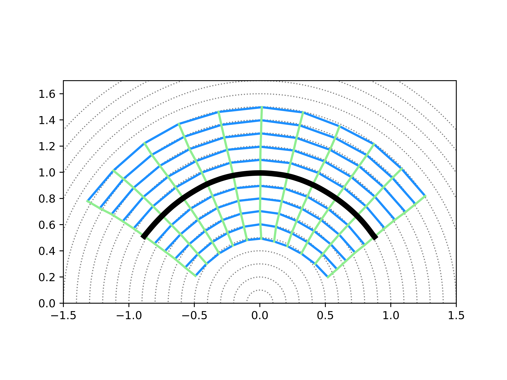

PyTorch code for *Isometric Manifold Learning using Hierarchical Flow*.


## Experiments

### Hardware & Software Dependency

- **Hardware**

    All experiments are done using a single NVIDIA RTX-2080Ti GPU.

- **Software**
    
    We use Ubuntu 18.04 platform with Python 3.7 and CUDA 11.6. 
    
    For all dependent libraries, please refer to ```requirements.txt```.
    
### Installation

1. Clone this repository.
    ```
    git clone https://github.com/PanZiqiAI/hierarchical-flow.git
    ```

2. Create python environment and install dependent libraries via ```pip```.
    ```
    yes | conda create --prefix=./venv python=3.7
    conda activate ./venv
    pip install -r requirements.txt
    ```

### Training

#### Preparing Datasets
All image datasets should be in directory ```Datasets```. Due to copyright reasons, we do not provide datasets here, please
download the dataset files yourself and prepare datasets as the following instructions. 

- *MNIST*

    Put the file ```t10k-images.idx3-ubyte```, ```t10k-labels.idx1-ubyte```, ```train-images.idx3-ubyte```, ```train-labels.idx1-ubyte``` in directory ```Datasets/mnist```.

- *CelebA*

    Put all 64x64 image files in directory ```Datasets/celeba-hq/celeba-64```.

- *FFHQ*

    Put all 64x64 image files in directory ```Datasets/ffhq/images64x64```.

- *AFHQ Cat*

    Put all 64x64 image files in directory ```Datasets/afhq/images64x64/train/cat```.

#### Running Experiments

- Train on *Circle* Synthetic Manifold
    ```
    cd hf-circle-manifold
    python script_train.py \
        --gen_hidden_ncs 128 --gen_ns_couplings 6 --svp_hidden_ncs 128 --svp_ns_layers 6 \
        --lambda_jacob=500.0 --lambda_recon=1000.0 --lambda_v=1000.0 --recon_mode=l2 \
        --desc="circle/hf"
    ```

- Train on Image Datasets

    The following command train HF on a *MNIST* subset containing a single category ```8```. 
    ```
    cd hf-images
    python script_train.py --dataset=single-mnist --dataset_category=8 \ 
        --u_nc=10 --middle_u_ncs 4 2 --upsamples 7 2 2 \
        --gen_hidden_ncs 512 256 128 --gen_ns_couplings 6 6 6 --svp_hidden_ncs 512 256 128 --svp_ns_layers 6 6 6 \
        --sampling_v_radius=0.1 --lambda_recon=1000.0 --recon_mode=l2 --lambda_v=1000.0 --freq_step_jacob=10 --lambda_jacob=1000.0 \
        --desc="single-mnist-8/hf"
    ```

By running the above commands, a directory ```STORAGE/experiments``` will be created, which stores training logs, 
evaluations, visualizations, and saved checkpoints. Another directory ```STORAGE/tensorboard``` will also be created, 
which stores *tensorboardX* visualization of training logs. 

## Results

### *Circle* Synthetic Manifold

<table style="width:auto">
    <tr>
        <td align="center"></td>
    </tr>
</table>

